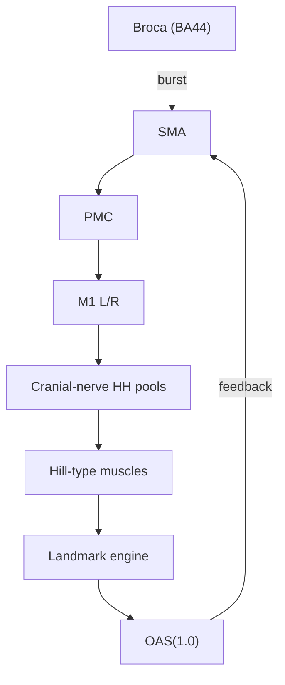

# NeuroOAS

*A Biophysically‑Grounded Simulator of Speech‑Motor Control and Oromotor Asymmetry*

> # DISCLAIMER: Code has not been uploaded. Expected upload date: TBD

## Purpose

NeuroOAS links high‑level cortical speech planning to low‑level facial kinematics.  It combines

\* **Mixed‑fidelity neural layers** – Izhikevich/LIF cortex and Hodgkin–Huxley (HH) brain‑stem pools.
\* **Biomechanical articulator models** – Hill‑type muscles driving a mouth landmark engine.
\* **Online Oromotor Asymmetry Score (OAS)** – real‑time quantification of left–right facial asymmetry.
\* **Lesion toggles** – simulate cortical or peripheral damage and predict the resulting OAS signature.

## System Overview

The simulator is organised in six layers (v 1.0 targets a 2‑D mouth model; 3‑D meshes are planned (OAS 2.0)).



## Layer Specifications

| Layer                                | Model               | Baseline Size             |
| ------------------------------------ | ------------------- | ------------------------- |
| Cortical (BA44 → SMA → PMC → M1)     | Izhikevich + LIF    | 450 neurons               |
| Corticobulbar projection             | Delay‑line synapses | 8 ms ipsi / 10 ms contra  |
| Cranial‑nerve pools (CN V, VII, XII) | Hodgkin–Huxley      | 20 neurons each           |
| Muscle layer                         | Hill‑type units     | 8 units                   |
| Landmark engine                      | 2‑D vector model    | 500 fps                   |
| OAS engine                           | Area / angle metric | frame, velocity, integral |

## Simulation Cycle

1. **Token** → Broca attractor.
2. SMA burst schedules gestures.
3. PMC maps gesture to M1 populations.
4. M1 excites bilateral cranial‑nerve pools.
5. HH neurons spike; Hill muscles contract.
6. Landmark positions update; OAS(t) computed.
7. Optional feedback adjusts SMA when |ΔOAS| exceeds threshold.


## Quick Start

```bash
# clone repository
git clone https://github.com/your‑handle/NeuroOAS.git
cd NeuroOAS

# build (C++)
cmake -B build && cmake --build build -j

# run baseline configuration
./build/neurooas run configs/baseline.yml
```

Python notebooks in `analysis/` reproduce published figures.

[Creative Commons Attribution 4.0 International](https://creativecommons.org/licenses/by/4.0/)
